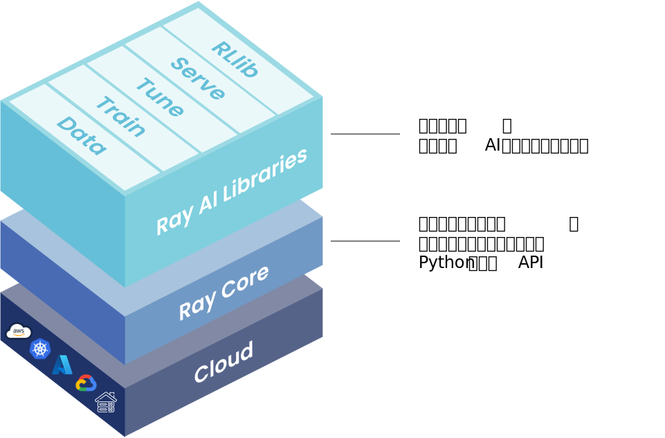

# Overview

Ray是一个开源的统一框架，用于扩展人工智能和Python应用程序，如机器学习。它提供了用于并行处理的计算层，使用户不需要成为分布式系统专家也能进行分布式计算相关的开发。Ray通过以下组件将分布式个体和端到端的机器学习工作流程的运行复杂性降至最低：

- 可扩展的软件库：用于常见机器学习任务（如数据预处理、分布式训练、调参、强化学习和模型服务等）
- Python风格的分布式计算原语（Primitives）：用于并行化和扩展Python应用程序
- 集成和实用工具：用于将Ray集群集成和部署到现有工具和基础设施（如Kubernetes、AWS、GCP和Azure）

在不需要基础设施专业知识的情况下，Ray可以让数据科学家和机器学习实践者对现有的作业流程进行扩展，包含以下几个方面：

- 轻松地将机器学习工作负载并行化和分布到多个节点和GPU上
- 利用具备原生和可扩展集成的机器学习生态系统

对于机器学习平台构建者和机器学习工程师，Ray提供以下功能：

- 为创建可扩展且健壮的机器学习平台提供了计算流程的抽象（Ray计算流程图）
- 提供了统一的机器学习API，可以更简单地与更广泛的机器学习生态系统进行接入和集成
- 使Python代码能从笔记本电脑到大型集群实现无缝扩展，缩小了开发与生产之间的迁移成本

对于分布式系统工程师，Ray可以自动处理以下关键的过程：

- 编排：管理分布式系统中各个组件
- 调度：协调任务执行的时间和位置
- 容错：在不可避免的故障中确保任务完成
- 自动扩展：根据动态需求调整分配资源的数量

## Ray可以用来做什么

以下是一些个人、组织和公司利用Ray构建他们的人工智能应用程序时常见的机器学习工作负载：

<!-- TODO: 添加超链接跳转 -->

- [CPU和GPU上的批量推理](./)
- [模型服务](./)
- [大模型分布式训练](./)
- [并行调参实验](./)
- [强化学习](./)
- [机器学习平台](./)

## Ray框架

Ray统一计算框架由以下三层构成：

1. Ray AI Libraries：开源的、针对特定领域的Python库，为机器学习工程师、数据科学家和研究人员提供可扩展且统一的机器学习应用工具包。
2. Ray Core：开源的、通用的Python分布式计算库，使得机器学习工程师和Python开发人员能够扩展Python应用程序并加速机器学习工作负载。
3. Ray Clusters：一组连接到共同Ray头节点的工作节点。Ray集群可以是固定大小的，也可以根据集群上运行的应用程序请求的资源进行自动扩展和缩减。

这三层分别对应三种不同的应用场景：

1. 扩展机器学习负载：Ray提供了分布式的[数据处理](./)、[模型训练](./)、[调参](./)、[强化学习](./)、[模型服务](./)和[更多方面](./)的工具包，用于构建机器学习应用
2. 构建分布式应用：Ray提供了[简单且灵活的API](./)用于构建并运行分布式应用，并且让用户可以使用很少的代码甚至不适用代码来对单机代码进行[并行化](./)
3. 部署大规模工作负载：在[AWS, GCP和Azure]或[premise](./)上部署工作负载。使用Ray集群管理器在[Kubernetes](./), [YARN](./), 或者[Slurm](./)集群上运行Ray.

Ray的五个原生库分别对应以下特定的机器学习任务：

- [Ray Data](./)：在训练、调参和预测过程中，可扩展且与框架无关的数据加载和转换。
- [Ray Train](./)：具有容错性的分布式多节点和多核模型训练，可与流行的训练库集成。
- [Ray Tune](./)：可扩展的超参数调整方案，以优化模型性能。
- [Ray Serve](./)：可扩展且可编程的模型服务，用于在线推断部署，可选择进行微批处理以提高性能。
- [Ray RLlib](./)：可扩展的分布式强化学习工作负载。

Ray的原生库既适用于数据科学家，也适用于机器学习工程师。对于数据科学家来说，这些库可以用于扩展个别工作负载，也可以用于端到端的机器学习应用程序。对于机器学习工程师来说，这些库提供了可扩展的平台抽象，可以轻松引入和整合更广泛的机器学习生态系统中的工具。

对于自定义应用程序，[Ray Core](./)库使得Python开发人员可以轻松构建可扩展的分布式系统，可以在笔记本电脑、集群、云端或Kubernetes上运行。它是Ray AI库和第三方集成（Ray生态系统）构建的基础。

Ray可以在任何机器、集群、云服务提供商和Kubernetes上运行，并且具有一个不断增长的社区集成[生态系统](./)。
